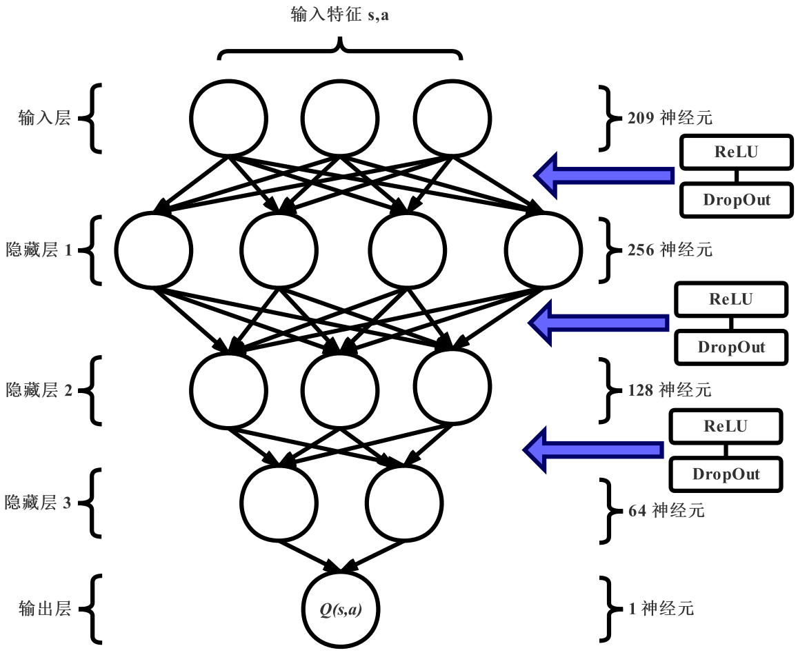
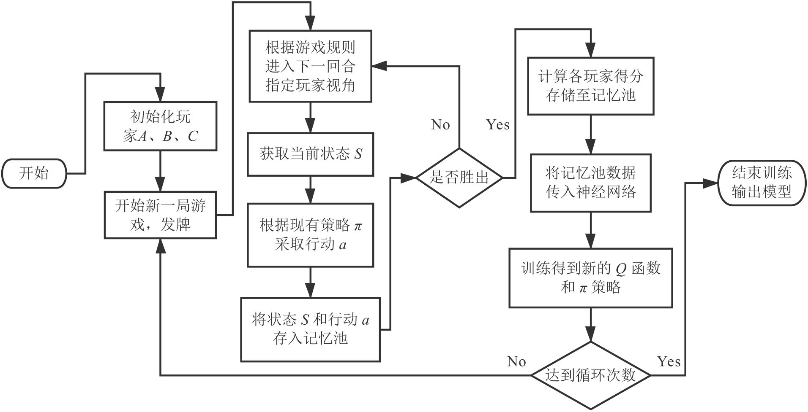
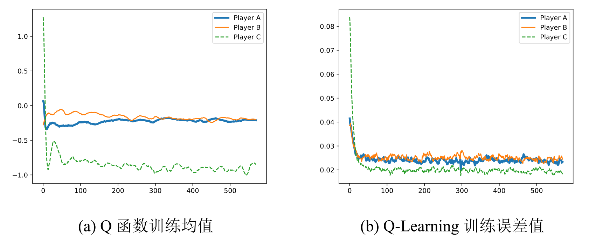
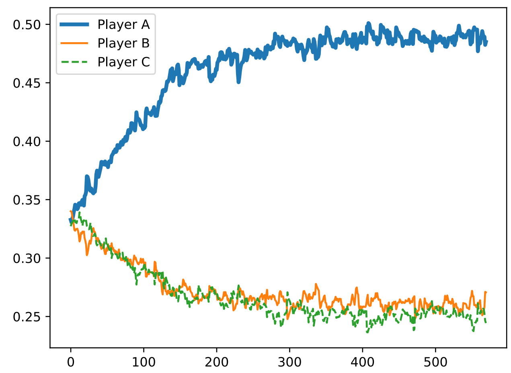

---
author:
- 信息与数据科学 张万鹏
date: '2019/5/24'
title: 不完全信息下强化学习的研究与应用
subtitle: Research and Application of Reinforcement Learning under Incomplete Information

---

## 一、背景

强化学习则是机器学习方法中的一类算法，在给定环境下模拟各种行为和动作，接收环境传递的激励和惩罚反馈，自行学习如何行动才能使长期收益最大化。

一场博弈中，如果玩家完美掌握了对手的策略、特征、回报函数等信息，称玩家掌握**完全信息**，并称这样的博弈为**完全信息博弈**，反之称为**不完全信息博弈**。

在不完全信息下，由于难以重建环境模型，首先需要建立对手的资源概率分布，才能进一步建立对手的策略概率分布，导致问题的解空间非常大，传统的强化学习方法难以克服这一问题，因此需要做出一些改进。

----

## 二、核心思想

传统强化学习的基本思想是把问题抽象为 Markov 决策过程，然后在其基础上提出了 Bellman 方程关系：
$$
v_{\pi}(s) = \sum_a\pi(a|s)\sum_{s',r}p(s',r|s,a)\left[r+\gamma v_\pi(s') \right]
$$
通过解该方程，理论上可以得到一个最优解，但该算法效率极低，只实用于简单问题。后面则将基于该核心思想进行改进和优化。

----

## 三、改进

### 改进一：Monte Carlo 模拟

通过引入 Monte Carlo 模拟方法，构造出环境模拟器来模拟采样算法所需的反馈值：
$$
G_t = R_{t+1} + \gamma R_{t+2} + \gamma^2 R_{t+3} + \cdots + \gamma^{T-t-1} R_T
$$
从而避免使用状态转移概率分布来直接计算期望的复杂做法。

----

### 改进二：Bootstrap 估计

基于统计学中的 Bootstrap 自助法，利用重抽样的思想来尽可能提升采样信息的信息价值：
$$
Q(S_t,A_t)\leftarrow Q(S_t,A_t)+\alpha\left[R_{t+1}+\gamma \widehat{Q}(S_{t+1},A_{t+1})-Q(S_t,A_t)\right]
$$
在保证准确度的前提下，进一步提高采样效率，从而加强算法效率。

----

### 改进三：$\varepsilon$-贪心学习

设定一个较小的探索率 $\varepsilon$ ，让算法以 $1-\varepsilon$ 的概率进行常规学习，$\varepsilon$ 的概率进行自由探索，从而较好地避免局部收敛的情况。
$$
\pi(a|s)=
\begin{cases}
\frac{\varepsilon}{|\mathcal A(s)|}&, a\text{为非贪心行动}\\
1-\varepsilon-\frac{\varepsilon}{|\mathcal A(s)|}&, a\text{为贪心行动}
\end{cases}
$$

----

## 四、优化

### 优化一：结合梯度下降法

将算法改造为参数化的算法，构造参数化的 loss function：
$$
J(\boldsymbol{w}) = \frac{1}{2}\left[R_{t+1}+\gamma\max_a\widehat{Q}(S_{t+1},a,\boldsymbol{w})-\widehat{Q}(S_t,A_t,\boldsymbol{w})\right]^2
$$
从而可以使用梯度下降法来进行高效收敛：
$$
\begin{aligned} \boldsymbol{w}_{t+1} =&\boldsymbol{w}_{t}-\alpha\nabla J(\boldsymbol{w}) \\ =&\boldsymbol{w}_{t}+\alpha\left[R_{t+1} - \gamma \max _{a} \widehat{Q}\left(S_{t+1}, a, \boldsymbol{w}_{t}\right)-\widehat{Q}\left(S_{t}, A_{t}, \boldsymbol{w}_{t}\right)\right]\\&\times\left[\gamma\nabla \max _{a} \widehat{Q}\left(S_{t+1}, a, \boldsymbol{w}_{t}\right)-\nabla \widehat{Q}\left(S_{t}, A_{t}, \boldsymbol{w}_{t}\right)\right] \end{aligned}
$$

----

### 优化二：使用 Neural Network

在梯度下降法的基础上，引入深度神经网络，进一步提升算法的收敛效率。

----

### 优化三：双神经网络抵消偏差

可以证明，构造两个神经网络 $Q_1,Q_2$ 来进行价值估计：
$$
Q_2(S,\mathop{\arg\max}\limits_aQ_1(a)) = Q_2(S,A^*)
$$
这样得到的估计值是真实值的无偏估计。基于这一定理，可以通过双神经网络来保证算法的精确度，确保能够学出正确的博弈策略。

----

## 五、仿真实验

基于一个纸牌游戏进行了仿真测试实验。

### （1）仿真实验流程

----

### （2）仿真实验结果

#### 收敛性

----

#### 实时训练胜率

----

## 六、总结与展望

论文提出了能够解决多人博弈问题的“自适应 Deep Q-Learning 算法”。该方法将传统的理论强化学习方法与新兴的深度学习技术相结合，其创新点在于使用了双神经网络来抵消偏差，以及分离神经网络进行交互博弈，来进行自适应学习。

目前，对于简单的完全信息博弈问题，已经提出了许多有着不错成果的强化学习理论，但对于更实际且更复杂的不完全信息博弈问题，还尚未得到充分的研究，因此，针对不完全信息博弈问题的强化学习将会是未来的一个重要研究方向，有待进一步地充分研究。

----

## 谢谢

感谢各位老师在百忙之中抽出时间参与论文审阅与答辩，谢谢!